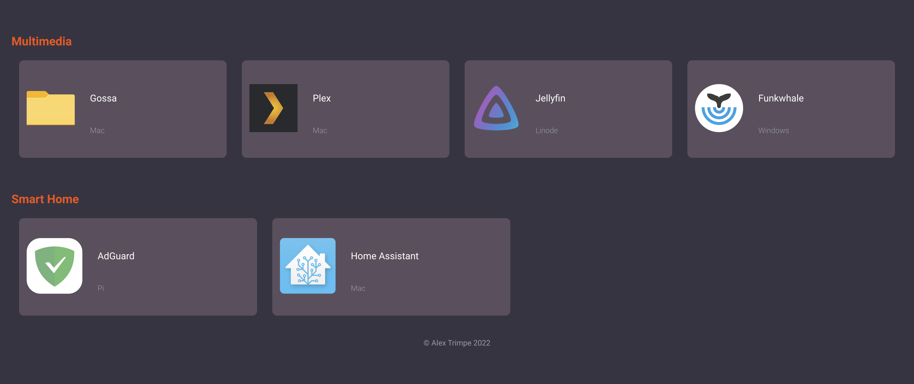

# Self Hosted Dashboard

A simple dashboard to remember the links to your self-hosted applications so you
don't have to.

### Setup

1. Pull a copy of this repo
1. Run `npm install`
1. Update dashboard.json with the relevant specifications for your applications
1. To run locally, simply execute the command `npm run start-node` within the
   directory. The application will start and run on port 5000

### Deployment

1. Update etc/selfhosteddashboard.service with the proper path (WorkingDirectory)
   to the location you have placed the dashboard
1. Copy selfhosteddashboard.service to /etc/systemd/system/
1. Run `systemctl enable selfhosteddashboard.service`
1. Run `systemctl start selfhosteddashboard.service`
